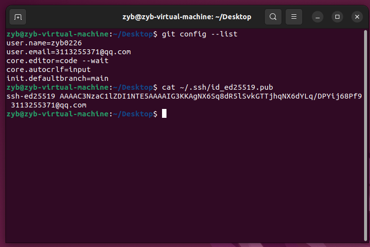
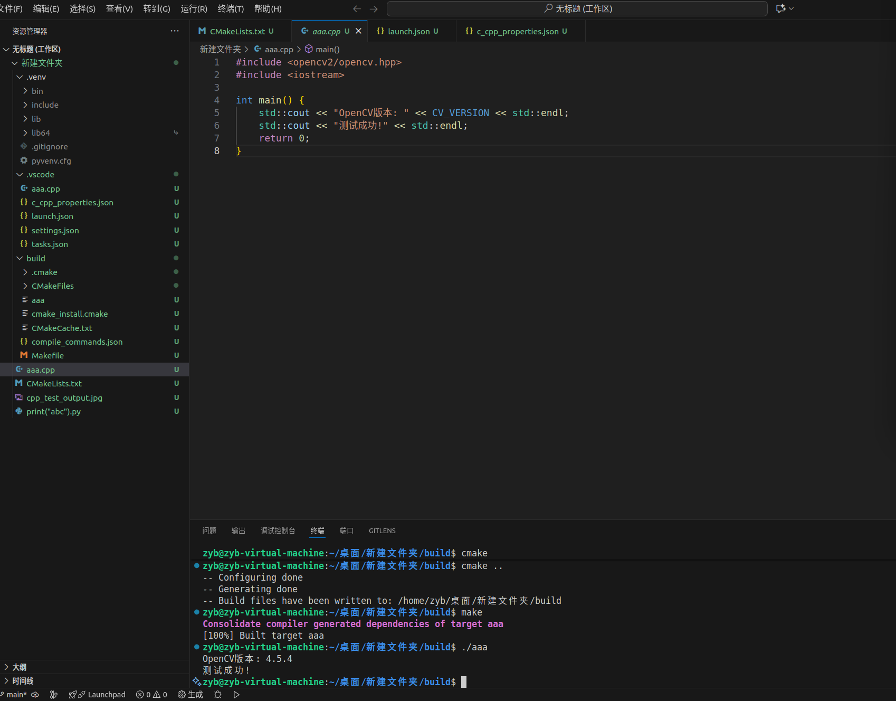

# HelloCV
仓库
2025210498 AI+先进技术 赵奕博

一、安装配置ROS2

1.设置locale
sudo locale-gen en_US en_US.UTF-8
sudo update-locale LC_ALL=en_US.UTF-8 LANG=en_US.UTF-8

2.添加ROS2仓库
sudo apt install software-properties-common
sudo add-apt-repository universe
sudo curl -sSL https://raw.githubusercontent.com/ros/rosdistro/master/ros.key -o /usr/share/keyrings/ros-archive-keyring.gpg

3.安装ROS2基础包
sudo apt update
sudo apt install ros-humble-ros-base -y

4.配置环境变量
echo "source /opt/ros/humble/setup.bash" >> ~/.bashrc
source ~/.bashrc

5.验证安装
ros2 --help
ros2 pkg list

6.配置C++
sudo apt update
sudo apt install ros-humble-demo-nodes-cpp
source /opt/ros/humble/setup.bash
ros2 pkg list | grep demo_nodes_cpp
ros2 run demo_nodes_cpp talker

运行结果在仓库图片ROS_test.png中

二、安装配置OpenCV

1.安装
sudo apt update
sudo apt install ros-humble-vision-opencv
sudo apt install libopencv-dev
sudo apt install python3-opencv

2.验证安装
pkg-config --modversion opencv4

3.配置C++
在VScode内部配置
mkdir opencv_project
cd opencv_project
# 创建源码目录和文件
mkdir src
touch CMakeLists.txt
touch src/main.cpp
# 在项目根目录执行以下命令
mkdir -p build && cd build
cmake -DCMAKE_BUILD_TYPE=Release ..
make -j$(nproc)
./opencv_example
# 编译运行
cd opencv_project
# 创建构建目录
mkdir build
cd build
# 生成Makefile
cmake ..
# 编译项目
make
#运行
./aaa

运行结果在仓库图片opencv_test.png中

三、安装配置VScode
运行结果见opencv_test.png
配置过程详见语雀笔记

四、安装配置Git

1. 安装
sudo apt update
sudo apt install git -y
git --version

2. 设置用户名和邮箱
git config --global user.name "zyb0226-hub"
git config --global user.email "3113255371@qq.com"
git config --list

3. 生成 SSH 密钥对
ssh-keygen -t ed25519 -b 4096 -C "id.com"
# 查看公钥
cat ~/.ssh/3113255371@qq.com_id.pub

运行结果在仓库图片Git_test中

语雀笔记链接

https://www.yuque.com/g/ruizhidehoutou/lcigge/sfoygkra1g73db40/collaborator/join?token=WTakiltiwZS0z3zo&source=doc_collaborator# 《Linux系统能力》

https://www.yuque.com/g/ruizhidehoutou/lcigge/rbgfd1zhhx0dto5z/collaborator/join?token=BpAOvkqjS7MTKYin&source=doc_collaborator&goto=%2Fruizhidehoutou%2Flcigge%2Frbgfd1zhhx0dto5z%2Fedit# 《实践任务记录》

https://www.yuque.com/g/ruizhidehoutou/lcigge/lw48uygvkrr2qu0w/collaborator/join?token=CbECNIxCcIQjl6yQ&source=doc_collaborator&goto=%2Fruizhidehoutou%2Flcigge%2Flw48uygvkrr2qu0w%2Fedit# 《Git操作》

